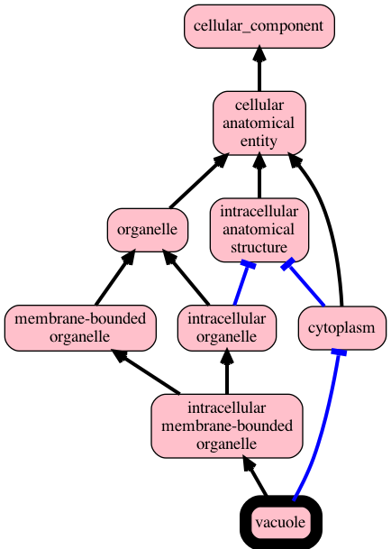

# Ontology Access Kit

Python lib for common ontology operations over a variety of backends.

[](https://badge.fury.io/py/oaklib)

[](https://mybinder.org/v2/gh/incatools/ontology-access-kit/main?filepath=notebooks)
[](https://pepy.tech/project/oaklib)
[](https://doi.org/10.5281/zenodo.6456239)

This library provides a collection of different [interfaces](https://incatools.github.io/ontology-access-kit/interfaces/index.html) for different kinds of ontology operations, including:

 - [lookup of basic features](https://incatools.github.io/ontology-access-kit/interfaces/basic.html) of an ontology element, such as it's label, definition, relationships, or aliases
 - search an ontology for a term
 - validating an ontology
 - updating, deleting, or modifying terms
 - ontology term matching
 - generating and visualizing subgraphs
 - provide specialized object models for more advanced operations, such as graph traversal, or OWL axiom processing, or text annotation

These interfaces are *separated* from any particular [backend](https://incatools.github.io/ontology-access-kit/implementations/index.html). This means the same API can be used regardless of whether the ontology:

 - is served by a remote API such as OLS or BioPortal
 - is present locally on the filesystem in owl, obo, obojson, or sqlite formats
 - is to be downloaded from a remote repository such as the OBO library
 - is queried from a remote database, including SPARQL endpoints (Ontobee/Ubergraph), A SQL database, a Solr/ES endpoint

## Documentation:

- [incatools.github.io/ontology-access-kit](https://incatools.github.io/ontology-access-kit)


## Example

```python
from src.oaklib.resource import OntologyResource
from src.oaklib.implementations.sqldb.sql_implementation import SqlImplementation

resource = OntologyResource(slug='tests/input/go-nucleus.db', local=True)
oi = SqlImplementation(resource)
for curie in oi.basic_search("cell"):
    print(f'{curie} ! {oi.get_label_by_curie(curie)}')
    for rel, fillers in oi.get_outgoing_relationship_map_by_curie(curie).items():
        print(f'  RELATION: {rel} ! {oi.get_label_by_curie(rel)}')
        for filler in fillers:
            print(f'     * {filler} ! {oi.get_label_by_curie(filler)}')
```

For more examples, see

- [demo notebook](https://github.com/incatools/ontology-access-kit/blob/main/notebooks/basic-demo.ipynb)

## Command Line

Documentation here is incomplete.

See [CLI docs](https://incatools.github.io/ontology-access-kit/cli.html)

### Search

Use the pronto backend to fetch and parse an ontology from the OBO library, then use the `search` command

```bash
runoak -i obolibrary:pato.obo search osmol 
```

Returns:

```
PATO:0001655 ! osmolarity
PATO:0001656 ! decreased osmolarity
PATO:0001657 ! increased osmolarity
PATO:0002027 ! osmolality
PATO:0002028 ! decreased osmolality
PATO:0002029 ! increased osmolality
PATO:0045034 ! normal osmolality
PATO:0045035 ! normal osmolarity
```

### QC and Validation

Perform validation on PR using sqlite/rdftab instance:

```bash
runoak -i sqlite:../semantic-sql/db/pr.db validate
```

### List all terms

List all terms obolibrary has for mondo

```bash
runoak -i obolibrary:mondo.obo terms 
```

### Lexical index

Make a lexical index of all terms in Mondo:

```bash
runoak  -i obolibrary:mondo.obo lexmatch -L mondo.index.yaml
```

### Search

Searching over OBO using ontobee:

```bash
runoak  -i ontobee: search tentacle
```

yields:

```
http://purl.obolibrary.org/obo/CEPH_0000256 ! tentacle
http://purl.obolibrary.org/obo/CEPH_0000257 ! tentacle absence
http://purl.obolibrary.org/obo/CEPH_0000258 ! tentacle pad
...
```

Searching over a broader set of ontologies in bioportal (requires API KEY)

```bash
runoak set-apikey bioportal YOUR-KEY-HERE
runoak  -i bioportal: search tentacle
```

yields:

```
BTO:0001357 ! tentacle
http://purl.jp/bio/4/id/200906071014668510 ! tentacle
CEPH:0000256 ! tentacle
http://www.projecthalo.com/aura#Tentacle ! Tentacle
CEPH:0000256 ! tentacle
...
```

Searching over more limited set of ontologies in Ubergraph:

```bash
runoak -v -i ubergraph: search tentacle
```

yields
```
UBERON:0013206 ! nasal tentacle
```

### Annotating Texts

```bash
runoak  -i bioportal: annotate neuron from CA4 region of hippocampus of mouse
```

yields:

```yaml
object_id: CL:0000540
object_label: neuron
object_source: https://data.bioontology.org/ontologies/NIFDYS
match_type: PREF
subject_start: 1
subject_end: 6
subject_label: NEURON

object_id: http://www.co-ode.org/ontologies/galen#Neuron
object_label: Neuron
object_source: https://data.bioontology.org/ontologies/GALEN
match_type: PREF
subject_start: 1
subject_end: 6
subject_label: NEURON

...
```

### Mapping

Create a SSSOM mapping file for a set of ontologies:

```bash
robot merge -I http://purl.obolibrary.org/obo/hp.owl -I http://purl.obolibrary.org/obo/mp.owl convert --check false -o hp-mp.obo
runoak lexmatch -i hp-mp.obo -o hp-mp.sssom.tsv
```


### Visualization of ancestor graphs

Use the sqlite backend to visualize graph up from 'vacuole' using test ontology sqlite:

```bash
runoak -i sqlite:tests/input/go-nucleus.db  viz GO:0005773
```



Same using ubergraph, restricting to is-a and part-of

```bash
runoak -i ubergraph:  viz GO:0005773 -p i,BFO:0000050
```

Same using pronto, fetching ontology from obolibrary

```bash
runoak -i obolibrary:go.obo  viz GO:0005773
```

## Documentation

- [incatools.github.io/ontology-access-kit](https://incatools.github.io/ontology-access-kit)

## Potential Refactoring

Currently all implementations exist in this repo/module, this results in a lot of dependencies

One possibility is to split out each implementation into its own repo and use a plugin architecture


